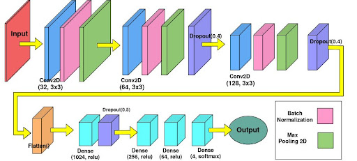
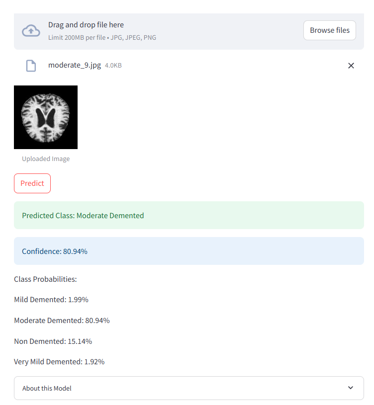

# PRONet - Alzheimer's Disease Detection 

## Overview
This project implements a novel CNN model **PRONet** for detecting and classifying different stages of Alzheimer's Disease using brain MRI scans. The system can classify images into four categories:
- Non Demented
- Mild Demented
- Moderate Demented
- Very Mild Demented

## PRONet: Custom self-trained CNN models for Alzheimer's disease classification
- This project introduces two new models: **PRONet-10** and **PRONet-5**, named according to their sizes.
- These models are developed keeping in mind the dataset's requirements, as well as to keep training and inferencing requirements low.
- PRONet-10 (shown below) achieved a near-perfect 0.988 test accuracy and 0.274 test loss.
- PRONet-5 achieved an impressive 0.976 test accuracy and 0.261 test loss.

<div align="center">
  
  <p><em>Figure 1: PRONet-10 Architecture</em></p>
</div>

Optimizer: `sgd`
Loss: `categorical_crossentropy`
Epochs: `100`

<div align="center">
  
  <p><em>Figure 1: Training and Validation Accuracy Plot for PRONet-10</em></p>
</div>

## Features
- Real-time image classification using deep learning
- Web-based user interface for easy interaction
- Support for common image formats
- Instant prediction results

## Tech Stack
- **UI**: Streamlit
- **Machine Learning**: TensorFlow, Keras
- **Data Processing**: NumPy, Pillow
- **Development**: Python 3.9
- **Dataset**: Download from this link > https://drive.google.com/file/d/1ctMe30lw7An7-Dlvii_Wp6r6j5s9j68t/view?usp=sharing

## Installation

1. Clone the repository.
   ```bash
   git clone https://github.com/pulkundwar29/PRONet
   cd PRONet
   ```
2. Create and activate virtual environment.
   ```bash
   venv env
   env\scripts\activate
   ```
3. Install required packages from requirements.txt.
   ```bash
   pip install -r requirements.txt
   ```
4. Download the dataset from the link: https://drive.google.com/file/d/1ctMe30lw7An7-Dlvii_Wp6r6j5s9j68t/view?usp=sharing. Save it in the main directory.
5. Run the model training notebook "train_PRONet.ipynb"
   ```bash
   # Execute cells to obtain tm41a.h5 as the trained model file for PRONet-10,
   # and tm32.h5 for PRONet-5.
   # You can change output filenames as per your desire.
   ```
6. Run the streamlit application file **test.py**.
   ```bash
   python test.py
   ```
7. Upload a file from one of the four classes and observe predicted output class.

<div align="center">
  
  <p><em>Figure 3: Streamlit Application</em></p>
</div>
